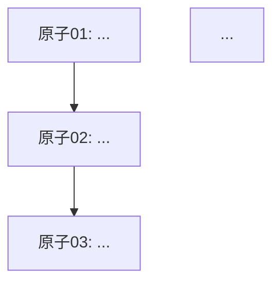

# 02 原子拆解：[活儿名]

> 拆解原则参考 [references/原子拆解标准.md](../../references/原子拆解标准.md)
> 必须过四门：输入门 / 输出门 / 可评估门 / 工具映射门

---

## 整件事的目的与最终交付物

[来自 01_访谈记录]

---

## 流程倒推（从交付物追到起点）

> 思考过程，写出来便于审查：要拿到最终交付物，前面必须先有什么？

- 最终交付物：…
- 之前必须有：…
- 之前必须有：…
- …
- 起点：…

---

## 原子清单

> 每个原子都要写完整的四要素 + 类型标签。粒度过粗或过细的，都要标注理由继续拆。

### 原子 01：[原子名]

- **输入**：[具体描述]
- **输出**：[具体描述]
- **成功标准**：[可观察]
- **工具/Prompt 映射**：[一句话能说出来用什么工具/什么 Prompt]
- **类型**：机械型 / 信息型 / 判断型 / 创作型
- **依赖**：[依赖哪些前置原子，N/A 表示起点]

### 原子 02：[原子名]

- 输入：…
- 输出：…
- 成功标准：…
- 工具/Prompt 映射：…
- 类型：…
- 依赖：…

### 原子 N：…

---

## 流程图（mermaid）

---

## 拆解自检

- [ ] 每个原子都过了四门（输入/输出/可评估/工具映射）
- [ ] 粒度一致——每个原子都对应"一次工具调用 / 一次主 Prompt + 必要迭代 / 一次人判断"
- [ ] 依赖关系清晰，没有循环
- [ ] 起点和终点对得上 01_访谈记录 里的"起 / 止"

---

## 准备进入下一步

- 确认进入 `03_评估与市面方案.md`
- 同时派发 N 个 subagent 任务，全部搜索结果汇总写入 `03_评估与市面方案.md`（参考 [搜索方案subagent调用规约.md](../../references/搜索方案subagent调用规约.md)）
